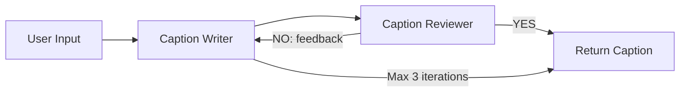

# CaptionAI — LinkedIn Caption Generator 🤖

AI-powered LinkedIn caption generator built with **Flask**, **LangGraph**, and **Groq (Llama 3.3 70B)**. Features a premium dark-mode UI with glassmorphism design.


---

## ✨ Features

- **AI Caption Generation** — Multi-step LangGraph pipeline: Write → Review → Refine
- **5 Tone Options** — Professional, Casual, Motivational, Storytelling, Thought Leadership
- **Dark / Light Theme** — Toggle with localStorage persistence
- **Typewriter Effect** — Animated text reveal for generated captions
- **Confetti Celebration** 🎉 — Particle burst on successful generation
- **Voice Input** — Speech-to-text for hands-free topic entry
- **Caption History** — Local storage with expand/collapse and individual delete
- **Keyboard Shortcuts** — `Ctrl+Enter` to generate, `Escape` to clear
- **Live Character Counter** — Real-time tracking with color warnings
- **Copy to Clipboard** — One-click copy with toast notification
- **Responsive Design** — Works on desktop and mobile

---

## 🛠️ Tech Stack

| Layer       | Technology                        |
|-------------|-----------------------------------|
| **Backend** | Flask (Python)                    |
| **AI/LLM**  | LangGraph + Groq (Llama 3.3 70B) |
| **Frontend**| Vanilla HTML/CSS/JS               |
| **Design**  | Glassmorphism, CSS Animations     |

---

## 🚀 Getting Started

### Prerequisites
- Python 3.10+
- [Groq API Key](https://console.groq.com/)

### Installation

```bash
# Clone the repository
git clone https://github.com/Bandinaresh01/linkedin_caption_writter.git
cd linkedin_caption_writter

# Create virtual environment
python -m venv venv
venv\Scripts\activate        # Windows
# source venv/bin/activate   # macOS/Linux

# Install dependencies
pip install -r requirements.txt
```

### Configuration

Create a `.env` file in the root directory:

```env
GROQ_API_KEY=your_groq_api_key_here
```

### Run

```bash
python app.py
```

Open [http://localhost:5000](http://localhost:5000) in your browser.

---

## 📁 Project Structure

```
├── app.py                      # Flask application
├── chat_bot/
│   ├── content_wr.py           # LangGraph pipeline (Writer → Reviewer)
│   └── templates/
│       └── home.html           # Main UI template
├── Static/
│   ├── style.css               # Premium design system (dark/light)
│   └── script.js               # Interactivity & animations
├── requirements.txt
├── .env                        # API keys (not tracked)
└── .gitignore
```

---

## 🧠 How It Works



1. **Caption Writer** — Generates a LinkedIn caption based on topic + tone
2. **Caption Reviewer** — Reviews for quality (hook, CTA, hashtags, length)
3. **Conditional Loop** — Iterates up to 3 times until approved

---

## 📸 Screenshots

### Dark Mode
Premium dark theme with animated gradient mesh background and glassmorphism cards.

### Light Mode
Clean light theme with soft gradients and high contrast readability.

---

## 📄 License

This project is open source and available under the [MIT License](LICENSE).
